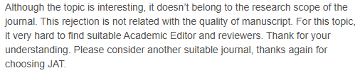

# To-complain-about-laodeng-graduate-advisor
我是一名在读硕士生，这个项目是吐槽老登专用！！！"I'm a master's student, and this GitHub project is where I vent about my graduate advisor."

### 1.（2025.10）

**吐槽点 1**

> 老登把我自己好好写的论文用 Deepkseek 改的一塌糊涂，现在感觉全是 AI 生成的，并且添加了许多与主题无关的内容。最致命的是，他并没有读过几篇相关领域的论文，全是通过新闻和 AI 来了解我的论文研究领域。

**Rant #1**

> Laodeng took the paper I wrote perfectly well myself and made a complete mess of it using Deepkseek. Now it looks like it was completely AI-generated, and he added a bunch of content irrelevant to the topic. The worst part is, he clearly hasn't read many papers in the relevant field; he gets his entire understanding of my research area from news articles and AI.
 
 

### 2. （2025.11.4）

**吐槽点 2**

> 和老登商量了一下硕士毕业论文的想法，毫不意外，老登用自己完全没有研究的领域给我说了一堆想法，我装模做样的在笔记本上记录。我给老登看了几篇相关专业领域双一流大学的硕士毕业论文，老登竟然认为他们做的太简单了，要求我的硕士论文的内容要比他们丰富，甚至要求我的那篇论文只能作为毕业论文的一个章节？？？可是别人的都是小论文扩充一下，就成了毕业论文...无语。另外，那篇论文已经被拒稿了，编辑告诉我不符合期刊主题，其实我自己清楚，那篇论文实在是太烂了。我爱你wiley，能不能让我中一次论文。
> 

**English**

> I discussed some ideas for my master's thesis with Laodeng. Unsurprisingly, Laodeng gave me a ton of ideas from a field he has absolutely zero research in, while I just pretended to take notes in my notebook. I showed him several master's theses from top-tier ("Double First-Class") universities in the relevant field. He actually thought their work was "too simple" and demanded that my thesis content be much more substantial than theirs. He even demanded that my existing paper should only be *one chapter* of the final thesis??? But everyone else just expands on their small papers, and that becomes their thesis... I'm speechless.
>
> Also, that paper already got rejected. The editor said it didn't fit the journal's theme. Honestly, I know it myself: that paper is just terrible. I love you, Wiley, please just let me get one paper accepted.
 
 

### 吐槽点 3

**中文**

> 老登，求求你看看论文吧，别搞豆包、deepseek科研，公众号科研了，别做井底之蛙了

**English**

> Laodeng, I'm begging you, please actually read some papers. Stop doing your "research" using AI tools like Doubao and Deepseek, and stop treating WeChat Official Accounts like academic sources. Stop being a frog in a well (ignorant and narrow-minded).
> 
 
 

### 吐槽点 4

**中文**

> 老登你总在不切实际的幻想，因为你不了解，也不用去做实验写论文

**English**

> Laodeng, you're always indulging in unrealistic fantasies. That's because you don't understand the subject, and you're not the one who actually has to run the experiments or write the paper.
